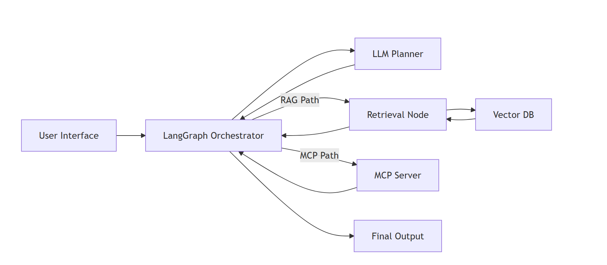

# Architect Engine: Senior Cloud Architect AI Visualizer

An interactive architectural platform for designing, simulating, and inspecting agentic LLM workflows. The app visualizes the handshake between a workflow orchestrator, reasoning engine, RAG memory, and tool execution (MCP) in a live, animated system map.

## ✨ Current Features
- Interactive SVG workflow map with UI, LG, LLM, RAG, VDB, MCP, and OUT nodes.
- Animated bi-directional traces with payload labels that open a Transaction Inspector.
- Clickable nodes that open a component panel with internal sub-systems and tech stack.
- Real-time routing logic with four paths: direct LLM, RAG-only, MCP-only, and hybrid RAG + MCP.
- Path reasoning history (last 5 runs) with deep routing rationale and quick log jump.
- Telemetry dashboard with grouped execution logs and a trace clear action.
- Pause and resume simulation while preserving animation timing.
- Zoom, pan, reset view, and fullscreen controls for the architecture canvas.
- Dark and light mode toggle.
- Synthesis drawer showing final input and model response.
- AI-driven component insight with internal model primary and Gemini fallback.
- API key detection indicator and active model status badge.

## 🧭 Architecture Diagram


## 🧩 Runtime Logic Paths
1. RAG-only: UI -> LG -> RAG -> VDB -> RAG -> LG -> OUT
2. MCP-only: UI -> LG -> MCP -> LG -> OUT
3. Hybrid: UI -> LG -> RAG -> VDB -> RAG -> LG -> MCP -> LG -> OUT
4. Direct LLM: UI -> LG -> LLM -> LG -> OUT

## 🛠️ Setup From Scratch (Vite + React + TypeScript)

### 1. Create the project
```bash
mkdir architect-engine
cd architect-engine
npm create vite@latest . -- --template react-ts
npm install
```

### 2. Install dependencies
```bash
npm install @google/generative-ai react-markdown dotenv
```

### 3. Replace or add source files
Copy the files from this repository into the root of the Vite app:
- App.tsx -> src/App.tsx
- types.ts -> src/types.ts
- constants.tsx -> src/constants.tsx
- services/geminiService.ts -> src/services/geminiService.ts
- components/AnimatedFlow.tsx -> src/components/AnimatedFlow.tsx
- index.tsx -> src/index.tsx

### 4. Update index.html for styling and diagrams
Ensure the project root index.html includes these:
- Tailwind CDN script
- Mermaid CDN script
- Inter and JetBrains Mono fonts

This repo already includes those tags in [index.html](index.html).

### 5. Configure environment variables
Create a .env file in the project root. You can use either an internal model key or a Gemini key.
```text
VITE_INTERNAL_API_KEY=your_internal_model_key
VITE_API_KEY=your_gemini_api_key
```

Notes:
- The app tries the internal model first, then falls back to Gemini.
- Accepts multiple key names, including VITE_GEMINI_API_KEY and VITE_GEMINI_API_PRIMARY_KEY.

### 6. Run the app
```bash
npm run dev
```

## 🧪 Technical Details
- Frontend: React 19 + Vite + TypeScript.
- Styling: Tailwind via CDN for rapid prototyping.
- Visual system: Custom SVG renderer with animated traces and internal component flow maps.
- AI services: Internal model gateway (Llama 3.3 70B) with Gemini fallback.
- Simulation: Step metadata drives telemetry logs and payload inspectors.

## 🧰 Troubleshooting
- No AI output: verify at least one of VITE_INTERNAL_API_KEY or VITE_API_KEY is present.
- Keys not detected: restart the dev server after editing .env.
- Blank screen: ensure index.html includes the Tailwind CDN script.
- Slow or no response: internal model times out after 4 seconds and falls back to Gemini.

## ❓ FAQ
- Can I run without API keys? Yes, but AI insights and synthesis will fall back to cached/offline responses.
- Why does the path choose MCP for math? The simulator routes deterministic tasks to tools for accuracy.
- Can I change the node layout? Yes, update node positions in src/components/AnimatedFlow.tsx.
- Can I add more tools? Yes, extend the MCP node details and the tool routing logic in App.tsx.

## 🙌 Credits
- Diagram rendering: Mermaid.
- UI fonts: Inter and JetBrains Mono.
- Icons: Emoji-based node icons.

## 📄 License
- This App is created by Rajeev K.

## 🧠 Prompt to Recreate This App
Use this prompt in any AI model to rebuild a functionally identical app:

```text
Build a Vite + React + TypeScript single-page app named "AI Flow Visualizer" that simulates an agentic workflow. Requirements:

UI/UX
- Full-screen layout with a top header containing: app title, a prompt input, a Run button, Pause/Resume while running, Reset button, and a Dark/Light toggle.
- Main area has an animated SVG architecture canvas (left) and a side panel (right) for component details or path history.
- Bottom panel is a collapsible telemetry dashboard with grouped run logs and a right column of logic pattern cards.
- Provide zoom in/out, reset view, and fullscreen controls on the canvas. Support pan/drag on the canvas.
- Clicking a node opens a detail panel with name, role, tech stack, and internal component details.
- Clicking a moving payload opens a modal "Transaction Inspector" that shows ingress and egress JSON.
- Provide a final synthesis drawer with the final prompt and the model response.

Architecture
- Nodes: UI, LG (orchestrator), LLM, RAG, VDB, MCP, OUT.
- Animated traces for request/response paths between nodes.
- Internal flow maps inside nodes (small sub-nodes with arrows) for each component.

Simulation Logic
- On Run, determine the path based on prompt content:
  - "rag only" forces RAG path.
  - "mcp tools only" forces MCP path.
  - Math/unit conversions or realtime keywords route to MCP.
  - Simple greetings route to direct LLM.
  - Otherwise default to hybrid RAG + MCP.
- Step through the path on a timer, emitting telemetry logs with labels, timestamps, and input/output payloads.
- Provide Pause/Resume that freezes animation timing.

AI Integration
- Create a service that calls an internal chat endpoint first (Llama 3.3 70B) with a 4s timeout and falls back to Gemini models if it fails.
- Use environment variables VITE_INTERNAL_API_KEY and VITE_API_KEY (also accept VITE_GEMINI_API_KEY and VITE_GEMINI_API_PRIMARY_KEY).
- Provide a function to fetch node insight from the AI and show it in the component panel.

Tech
- Use Tailwind via CDN in index.html.
- Use Mermaid CDN script in index.html for documentation diagrams.
- Use React hooks only (no state libraries).
- File layout: src/App.tsx, src/components/AnimatedFlow.tsx, src/services/geminiService.ts, src/constants.tsx, src/types.ts, src/index.tsx.
```
